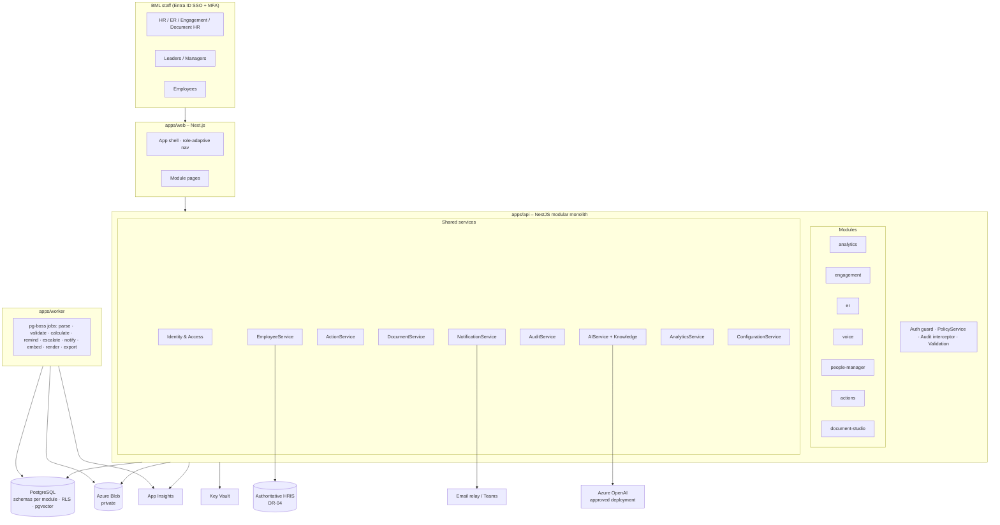

# C. Final Platform Architecture

Status: **PROPOSED – provisional until DR-02 (stack/hosting) and DR-03 (tenant/region/residency) are confirmed by BML IT and Information Security.** The blueprint [BP §16] frames every layer as "recommended direction (subject to IT/security approval)" and requires a Power Platform alternative to be evaluated (conflict C-06).

## C.1 Architectural style

**Modular monolith** + **background worker**, not microservices (AS-01).

- One API deployable containing all modules and shared services, with enforced module boundaries (a module may import another module only through its public service interface; lint rule blocks deep imports).
- One worker deployable running the same codebase for jobs (imports, calculations, notifications, reminders, AI, rendering).
- Rationale: one small team, strong transactional consistency needs (case chronology + audit + action in one transaction), and a much smaller attack surface to get through Information Security review. Module boundaries keep later extraction possible.

## C.2 Stack recommendation

| Layer | Recommendation | Why | Alternative if IT prefers |
|---|---|---|---|
| Frontend | **Next.js (App Router) + React + TypeScript** | Blueprint direction; server-rendered internal app; shares types with API | – |
| UI kit | Radix primitives + Tailwind in `packages/ui` (shadcn-style, owned code) | Accessible primitives; one design language; no vendor lock | Fluent UI React (Microsoft look) |
| Backend | **NestJS (TypeScript)** | One language across web/api/worker/shared packages → shared Zod schemas and permission constants; Nest modules map 1:1 to blueprint modules; guards/interceptors suit server-side policy + audit | **ASP.NET Core** – choose it if BML IT's supported skill base and ops tooling are .NET. The design (modules, services, schema) is language-neutral |
| Database | **PostgreSQL 16** (Azure Database for PostgreSQL – Flexible Server) | Row-Level Security as defence-in-depth for ER/Voice; JSONB for rule/config definitions; `pgvector` keeps RAG embeddings inside the same governed, backed-up, encrypted store; `ltree`/recursive CTEs for hierarchy; open-source parity DEV→PROD | **Azure SQL** – has RLS too; vector store would then be Azure AI Search (extra service to approve) |
| ORM / migrations | Drizzle ORM + SQL migrations committed and reviewable | Readable SQL for DBA/InfoSec review; supports RLS policies and triggers | Prisma |
| Jobs / queue | **pg-boss** (Postgres-backed queue) with transactional outbox | No extra infrastructure; job enqueue commits atomically with the business change | Azure Service Bus behind the same `JobQueue` interface |
| Files | Azure Blob Storage, private containers, no anonymous access; Azurite in DEV | Blueprint direction; immutability policies available for audit exports | Approved SharePoint library via Graph |
| Document rendering | DOCX via `docxtemplater` on approved .docx templates; PDF via LibreOffice headless in worker container | Templates stay editable in Word by HR; deterministic merge | Aspose (licensed) |
| Auth | Microsoft Entra ID (OIDC, auth code + PKCE) for web; API validates Entra-issued access tokens | Blueprint §16 | – |
| AI | `AIService` interface → Azure OpenAI provider (approved deployment) / deterministic mock provider | Blueprint §14/§16; replaceable | Any Bank-approved enterprise endpoint |
| Secrets | Azure Key Vault (managed identity); `.env` only in DEV | Blueprint §16 | – |
| Observability | OpenTelemetry → Application Insights; pino structured logs with redaction | Blueprint §16, §25.1 | – |
| Charts | Application-native (ECharts or Recharts) | Blueprint §16 "native initially" | Power BI Embedded (DR-46) |
| CI/CD | GitHub Actions *or* Azure DevOps Pipelines (DR-47) | – | – |
| Hosting | Azure App Service or Azure Container Apps in BML tenant, private networking | Blueprint §16 | Internal hosting |

## C.3 Logical architecture



## C.4 Request path and enforcement points

1. Browser → Next.js server: Entra session (httpOnly, secure cookie). Next.js holds no business authorisation logic.
2. Next.js → API with the user's Entra access token (audience = API app registration).
3. API **AuthGuard** validates signature, issuer, audience, expiry → resolves `app_user`.
4. **PolicyService** builds the `SecurityContext`: roles, permissions, org scopes (as-of today), case/record grants, restricted-field grants. Cached per request only.
5. Controller declares required permission (`@Requires('er.case.read')`); the handler calls `policy.assertCan(ctx, action, resource)` with the *loaded record* (record-level check), not just the route.
6. Queries apply scope filters in the repository layer; for ER and Voice schemas **Postgres RLS** additionally filters by `app.current_user_id` set per transaction (defence-in-depth).
7. Response serialisers apply **field projection** (mask salary/NID/passport unless granted).
8. **AuditInterceptor** + explicit `audit.record()` calls write to the outbox in the same transaction as the change.

## C.5 Data architecture principles

- **Schema per module** in one database: `platform`, `org`, `actions`, `documents`, `analytics`, `engagement`, `er`, `voice`, `manager`, `studio`, `knowledge`, `ai`, `audit`, `config`. Cross-schema foreign keys allowed only to `platform`/`org`/`documents`/`actions` shared tables.
- **No Employee Master.** Modules store `employee_uid` references. Live facts come from EmployeeService. `analytics.employee_snapshot` is a period-bound, approved analytics snapshot — not a master and never used for letters.
- In DEV/UAT the "HRIS" is a **separate synthetic HRIS stub** (`synthetic_hris` schema / service) that stands in for the real system behind the `EmployeeProvider` interface. It never exists in PROD.
- **Effective dating** for org units, configuration, metric definitions, templates, JDs, knowledge, allocation rules.
- **Immutability**: approved snapshots, published metric versions, case events, audit events, issued documents. Corrections are new versions/amendments.
- UTC storage; Maldives time (UTC+5) display (AS-02).

## C.6 AI / RAG architecture (summary – detail in `docs/ai-rag-design.md`, Phase 6)

```
Module use-case → AIService.run(useCaseId, input, ctx)
   → PolicyGate (is use case enabled? user permitted? data classes allowed?)
   → EvidenceBuilder (minimum permitted facts; typed, labelled)
   → Retriever (pgvector + FTS hybrid; filters: doc type, position, approval=APPROVED,
                effective_from ≤ asOf < effective_to, audience, sensitivity ≤ clearance)
   → PromptTemplate vN (system rules | FACTS | SOURCES (as data) | USER INPUT | TASK) → structured output schema
   → Provider (Azure OpenAI / Mock)
   → PostValidators (fact tokens ⊆ evidence; numbers/dates/names check; locked sections; prohibited-content rules)
   → ai_interaction record (model, prompt version, sources, user, hashes) → returned as DRAFT awaiting human review
```
Factual fields are merged into documents **by code after generation**; AI output never supplies them.

## C.7 Environments (see `I-development-environment.md`)

| | DEV | UAT | PROD |
|---|---|---|---|
| Data | Synthetic only (generator, fixed seed) | Approved masked/test data (DR-45) | Live controlled data |
| Identity | Mock IdP personas **and** Entra DEV tenant/app reg | Entra (UAT app registration, test groups) | Entra (PROD app registration, governed groups) |
| EmployeeService provider | `synthetic` | `synthetic` or `hris-uat` | `hris` (DR-04) |
| AI provider | `mock` (deterministic); optional approved sandbox | Approved endpoint, masked data | Approved endpoint |
| Notifications | Captured in local mail catcher / in-app only | Allow-listed test recipients | Live |
| Mock login | Enabled | **Physically absent** (build flag + runtime refusal) | **Physically absent** |
| Separate resources | Own DB, blob, vault | Own DB, blob, vault | Own DB, blob, vault, private network |

## C.8 Non-functional targets (proposed, to confirm with IT)

| Concern | Proposal |
|---|---|
| Availability | Business-hours critical; target to be set by IT (DR-10) |
| Backup | PITR on database; blob soft-delete + versioning; RPO/RTO per DR-10 |
| Performance | P95 < 1 s for list/detail screens at BML scale (~1,200 staff, multi-year history) |
| Security testing | SAST, dependency scanning, secret scanning in CI; pen test before PROD |
| Browser support | Bank standard browser (Edge/Chrome current) – DR-40 |
